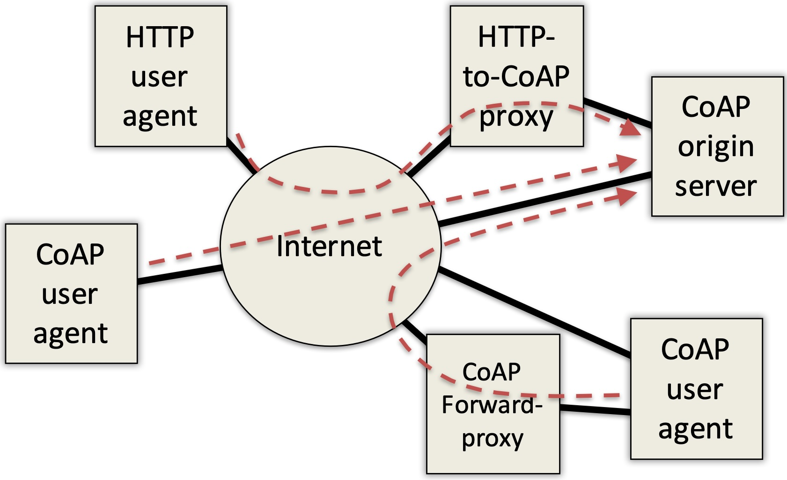
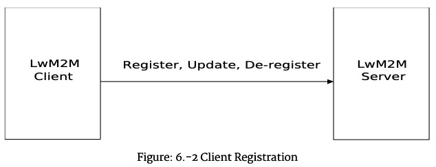
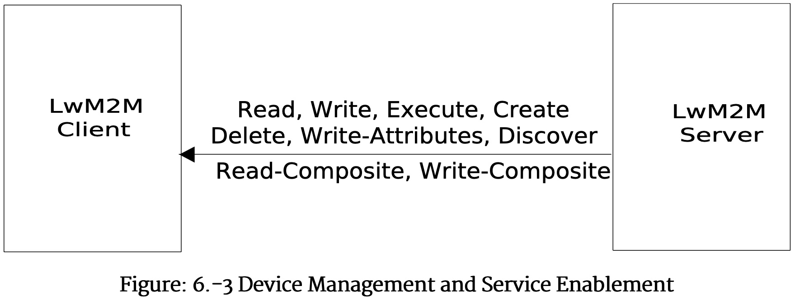
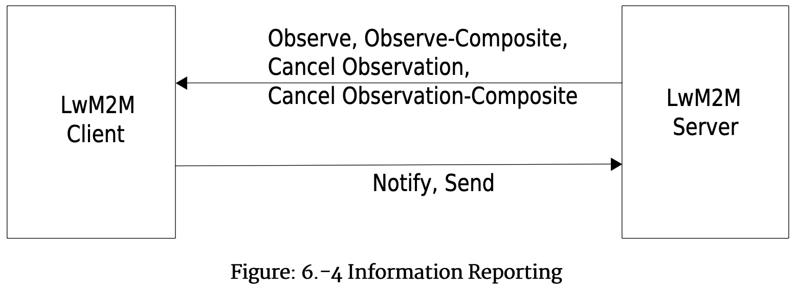
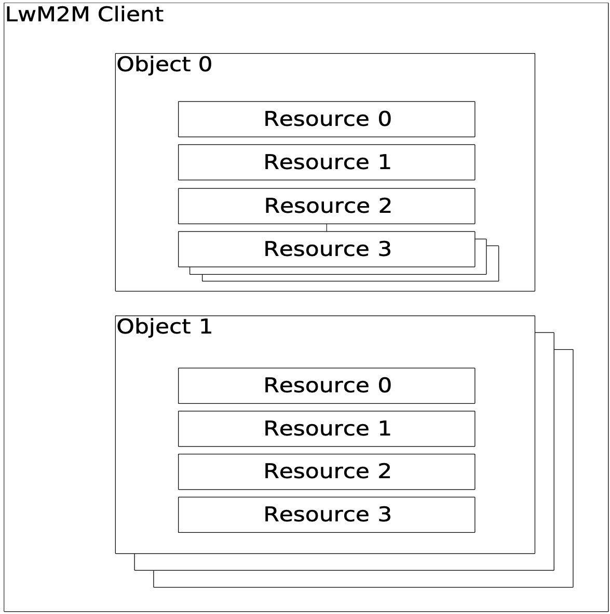

--- 
theme: dracula
style: |
    section { 
        background-color: #ddd;
        color-background-code: #ccc;
        color-background-paginate: rgba(128, 128, 128, 0.05);
        color-foreground: #345;
        color-highlight: #99c;
        color-highlight-hover: #aaf;
        color-highlight-heading: #99c;
        color-header: #bbb;
        color-header-shadow: transparent;
  }
paginate: true
title: CoAP & LwM2m 101
description: An introduction into CoAP and how it correlates to our LwM2m
author: Raffael Wojtas
keywords: coap,lwm2m
---

<style>
blockquote {
    margin: 0.5em 0 0 0;
}
</style>


<!--

We simply use CoAP and it makes sense to understand what's going on.
How CoAP maps to LwM2m and how it is implemented.

-->

---


# Our goal for today

Answer questions like:

- What is coap?
- How do observations work?
- What is a piggybacked message?
- Blockwise transfer in action
- see wireshark 🦈

--- 

# Agenda

1. CoAP overview
2. CoAP messaging model
3. CoAP Observations
4. CoAP Blockwise transfers 🦈
5. LwM2m overview
6. LwM2m operations
7. LwM2m operations in action

---

# What is `CoAP`? 

[CoAP RFC 7252](https://datatracker.ietf.org/doc/html/rfc7252)
> CoAP, or Constrained Application Protocol, is a specialized web transfer protocol designed for resource-constrained devices and networks in the context of the Internet of Things (IoT).

<style scoped>
pre { 
    font-size: 0.8em;
}
</style>
```
+----------------------+
|      Application     |
+----------------------+
+----------------------+  \
|  Requests/Responses  |  |
|----------------------|  | CoAP
|       Messages       |  |
+----------------------+  /
+----------------------+
|          UDP         |
+----------------------+
```

<!--

It's an application protocol very similar to HTTP with specialities for IoT, i.e. being small, both are server and client, observations...

-->

---

# CoAP Goals

- Simple & easy to understand
- HTTP convertable
- Constrained devices oriented

---

# CoAP Deployment



---

- A full redesign of HTTP with new features, not just a compressed / ‘dumped down’ version
- Binary protocol for different content types
- Runs on top of UDP (as well as TCP, SMS, ...)
- Native support for push notifications (with best effort semantics) in addition to traditional request / response
- Other features: discovery, multicast, HTTP mapping, DTLS security binding

---

## Similarities to HTTP

- Requests and responses, mirroring the structure of HTTP
- Requests include methods such as GET, POST, PUT, and DELETE defining the action to be performed on a resource
- Responses include status codes
- URI structure: `coap-URI = "coap:" "//" host [ ":" port ] path-abempty [ "?" query ]`

---

## Differences to HTTP 

- adjusted to constraind, power limited devices (it's binary)
- reduction of header overheader by using UDP
- built-in support for observing resources
- both sides are client and server

---

# Header structure
<style scoped>
p { 
    font-size: 0.6em;
}
</style>
```
 0                   1                   2                   3
 0 1 2 3 4 5 6 7 8 9 0 1 2 3 4 5 6 7 8 9 0 1 2 3 4 5 6 7 8 9 0 1
+-+-+-+-+-+-+-+-+-+-+-+-+-+-+-+-+-+-+-+-+-+-+-+-+-+-+-+-+-+-+-+-+
|Ver| T |  TKL  |      Code     |          Message ID           |
+-+-+-+-+-+-+-+-+-+-+-+-+-+-+-+-+-+-+-+-+-+-+-+-+-+-+-+-+-+-+-+-+
|   Token (if any, TKL bytes) ...
+-+-+-+-+-+-+-+-+-+-+-+-+-+-+-+-+-+-+-+-+-+-+-+-+-+-+-+-+-+-+-+-+
|   Options (if any) ...
+-+-+-+-+-+-+-+-+-+-+-+-+-+-+-+-+-+-+-+-+-+-+-+-+-+-+-+-+-+-+-+-+
|1 1 1 1 1 1 1 1|    Payload (if any) ...
+-+-+-+-+-+-+-+-+-+-+-+-+-+-+-+-+-+-+-+-+-+-+-+-+-+-+-+-+-+-+-+-+
```
T: Indicates if this message is of type Confirmable (0), Non-confirmable (1), Acknowledgement (2), or Reset (3).  The semantics of these message types are defined in Section 4.

---

# Message types

- Confirmable
- Non-confirmable
- Acknowledgement
- Reset message
    - indicates that a specific message could not be processed
    - i.e. empty confirmable
- Piggybacked Response
- Separate Response
- Empty

---

# Messaging model (1)

```
                        Client              Server
                           |                  |
                           |   CON [0x7d34]   |
                           +----------------->|
                           |                  |
                           |   ACK [0x7d34]   |
                           |<-----------------+
                           |                  |
                  Figure 2: Reliable Message Transmission
```

---

# Messaging model (2)

```
                        Client              Server
                           |                  |
                           |   NON [0x01a0]   |
                           +----------------->|
                           |                  |
                 Figure 3: Unreliable Message Transmission
```

---
<style scoped>
pre { 
    font-size: 1em;
}
p {
    font-size: 0.5em;
}
</style>

# Messaging model (3)

```
        Client              Server       Client              Server
           |                  |             |                  |
           |   CON [0xbc90]   |             |   CON [0xbc91]   |
           | GET /temperature |             | GET /temperature |
           |   (Token 0x71)   |             |   (Token 0x72)   |
           +----------------->|             +----------------->|
           |                  |             |                  |
           |   ACK [0xbc90]   |             |   ACK [0xbc91]   |
           |   2.05 Content   |             |  4.04 Not Found  |
           |   (Token 0x71)   |             |   (Token 0x72)   |
           |     "22.5 C"     |             |   "Not found"    |
           |<-----------------+             |<-----------------+
           |                  |             |                  |

           Figure 4: Two GET Requests with Piggybacked Responses
```

Piggybacked: In the most basic case, the response is carried directly in the Acknowledgement message that acknowledges the request (which requires that the request was carried in a Confirmable message).  This is called a "Piggybacked Response".

---
<style scoped>
pre { 
    font-size: 0.7em;
}
</style>

# Messaging model (4) 

```
                        Client              Server
                           |                  |
                           |   CON [0x7a10]   |
                           | GET /temperature |
                           |   (Token 0x73)   |
                           +----------------->|
                           |                  |
                           |   ACK [0x7a10]   |
                           |<-----------------+
                           |                  |
                           ... Time Passes  ...
                           |                  |
                           |   CON [0x23bb]   |
                           |   2.05 Content   |
                           |   (Token 0x73)   |
                           |     "22.5 C"     |
                           |<-----------------+
                           |                  |
                           |   ACK [0x23bb]   |
                           +----------------->|
                           |                  |
             Figure 5: A GET Request with a Separate Response
```

<!---
without risking the client repeatedly retransmitting the request message
-->

---
# Messaging model (5)

```
                        Client              Server
                           |                  |
                           |   NON [0x7a11]   |
                           | GET /temperature |
                           |   (Token 0x74)   |
                           +----------------->|
                           |                  |
                           |   NON [0x23bc]   |
                           |   2.05 Content   |
                           |   (Token 0x74)   |
                           |     "22.5 C"     |
                           |<-----------------+
                           |                  |
       Figure 6: A Request and a Response Carried in Non-confirmable
                                 Messages
```
---
<style scoped>
pre { 
    font-size: 0.7em;
}
</style>

# CoAP Options

```
   +-----+---+---+---+---+----------------+--------+--------+----------+
   | No. | C | U | N | R | Name           | Format | Length | Default  |
   +-----+---+---+---+---+----------------+--------+--------+----------+
   |   1 | x |   |   | x | If-Match       | opaque | 0-8    | (none)   |
   |   3 | x | x | - |   | Uri-Host       | string | 1-255  | (see     |
   |     |   |   |   |   |                |        |        | below)   |
   |   4 |   |   |   | x | ETag           | opaque | 1-8    | (none)   |
   |   5 | x |   |   |   | If-None-Match  | empty  | 0      | (none)   |
   |   7 | x | x | - |   | Uri-Port       | uint   | 0-2    | (see     |
   |     |   |   |   |   |                |        |        | below)   |
   |   8 |   |   |   | x | Location-Path  | string | 0-255  | (none)   |
   |  11 | x | x | - | x | Uri-Path       | string | 0-255  | (none)   |
   |  12 |   |   |   |   | Content-Format | uint   | 0-2    | (none)   |
   |  14 |   | x | - |   | Max-Age        | uint   | 0-4    | 60       |
   |  15 | x | x | - | x | Uri-Query      | string | 0-255  | (none)   |
   |  17 | x |   |   |   | Accept         | uint   | 0-2    | (none)   |
   |  20 |   |   |   | x | Location-Query | string | 0-255  | (none)   |
   |  35 | x | x | - |   | Proxy-Uri      | string | 1-1034 | (none)   |
   |  39 | x | x | - |   | Proxy-Scheme   | string | 1-255  | (none)   |
   |  60 |   |   | x |   | Size1          | uint   | 0-4    | (none)   |
   +-----+---+---+---+---+----------------+--------+--------+----------+
             C=Critical, U=Unsafe, N=NoCacheKey, R=Repeatable
                             Table 1: Options
```
---


# CoAP Observations

- is an extension [RFC 7641](https://datatracker.ietf.org/doc/html/rfc7641#section-1.4)

> simple protocol extension for CoAP that enables CoAP clients to "observe" resources, i.e., to retrieve a representation of a resource and keep this representation updated by the server over a period of time [...] The protocol does not offer explicit means for setting up triggers or thresholds;

---

# Observe Option

```
       +-----+---+---+---+---+---------+--------+--------+---------+
       | No. | C | U | N | R | Name    | Format | Length | Default |
       +-----+---+---+---+---+---------+--------+--------+---------+
       |   6 |   | x | - |   | Observe | uint   | 0-3 B  | (none)  |
       +-----+---+---+---+---+---------+--------+--------+---------+
                   C=Critical, U=Unsafe, N=No-Cache-Key, R=Repeatable
                        Table 2: The Observe Option
```

<!--
If the server
   returns a 2.xx response that includes an Observe Option as well, the
   server has successfully added an entry with the client endpoint and
   request token to the list of observers of the target resource, and
   the client will be notified of changes to the resource state.
-->
---

# CoAP Notification

- The only difference between a notification and a normal response is the presence of the Observe Option.
- the server sends a notification with an appropriate response code (such as 4.04 Not Found) and removes the client's entry from the list of observers of the resource.
- can be confirmable or non-confirmable

---

# CoAP Notification (2)

- An acknowledgement message signals to the server that the client is alive and interested in receiving further notifications; if the server does not receive an acknowledgement in reply to a confirmable notification, it will assume that the client is no longer interested and will eventually remove the associated entry from the list of observers
- If a client does not recognize the token in a confirmable notification, it must not acknowledge the message and should reject it with a Reset message; otherwise, the client MUST acknowledge the message as usual.  In the case of a non-confirmable notification, rejecting the message with a Reset message is OPTIONAL.
- To cancel an observation the client sends on the next message a Reset message
- To de-register clients sets observation flag to 1

---

# Observe Server Side Requirements

- on registration the server returns the current representation of the resource and adds client to list of observers
- consists of client endpoint + token

<!--
IP Address, Port number, optional security parameters and transport protocol
-->


---
<style scoped>
pre { 
    font-size: 0.7em;
    }
</style>
# Observe messaging

```
         Observed   CLIENT  SERVER     Actual
     t   State         |      |         State
         ____________  |      |  ____________
     1                 |      |
     2    unknown      |      |     18.5 Cel
     3                 +----->|                  Header: GET 0x41011633
     4                 | GET  |                   Token: 0x4a
     5                 |      |                Uri-Path: temperature
     6                 |      |                 Observe: 0 (register)
     7                 |      |
     8                 |      |
     9   ____________  |<-----+                  Header: 2.05 0x61451633
    10                 | 2.05 |                   Token: 0x4a
    11    18.5 Cel     |      |                 Observe: 9
    12                 |      |                 Max-Age: 15
    13                 |      |                 Payload: "18.5 Cel"
    14                 |      |
    15                 |      |  ____________
    16   ____________  |<-----+                  Header: 2.05 0x51457b50
    17                 | 2.05 |     19.2 Cel      Token: 0x4a
    18    19.2 Cel     |      |                 Observe: 16
    29                 |      |                 Max-Age: 15
    20                 |      |                 Payload: "19.2 Cel"
    21                 |      |
```
<!--
     Figure 3: A Client Registers and Receives One Notification of the
         Current State and One of a New State upon a State Change
-->


---
<style scoped>
pre { 
    font-size: 0.65em;
    }
</style>


```
     t   Observed   CLIENT  SERVER     Actual
         ____________  |      |  ____________
    22                 |      |
    23    19.2 Cel     |      |     19.2 Cel
    24                 |      |  ____________
    25                 | X----+                  Header: 2.05 0x51457b51
    26                 | 2.05 |     19.7 Cel      Token: 0x4a
    27                 |      |                 Observe: 25
    28                 |      |                 Max-Age: 15
    29                 |      |                 Payload: "19.7 Cel"
    30                 |      |
    31   ____________  |      |
    32                 |      |
    33    19.2 Cel     |      |
    34    (stale)      |      |
    35                 |      |
    36                 |      |
    37                 |      |
    38                 +----->|                  Header: GET 0x41011634
    39                 | GET  |                   Token: 0xb2
    40                 |      |                Uri-Path: temperature
    41                 |      |                 Observe: 0 (register)
    42                 |      |
    43                 |      |
    44   ____________  |<-----+                  Header: 2.05 0x61451634
    45                 | 2.05 |                   Token: 0xb2
    46    19.7 Cel     |      |                 Observe: 44
    47                 |      |                 Max-Age: 15
    48                 |      |                    ETag: 0x78797a7a79
    49                 |      |                 Payload: "19.7 Cel"
    50                 |      |
```

---

> CoAP is nice for small values, but what about big files, i.e. FOTA?


---

# CoAP Blockwise transfer

<style scoped>
p { 
    font-size: 0.75em;
}
</style>
TLDR: you want to avoid splitting on UDP or IP level


- Adds a pair of Block options
    - Transfers larger than what can be accommodated in onstrained network link layer packets can be performed in smaller blocks
    - no hard-to-manage conversation state is created at the adaptation layer or IP layer for fragmentation
    - the transfer of each block is acknowledged, enabling individual retransmission if required
    - both sides discuss block sizes: `Size1, Size2, Block1, Block2`

[RFC 7959 - Source](https://datatracker.ietf.org/doc/html/rfc7959)

---
<style scoped>
pre { 
    font-size: 0.75em;
}
</style>
Download example - `Block2`
``` 
   CLIENT                                                     SERVER
     |                                                          |
     | CON [MID=1234], GET, /status, 2:0/0/64           ------> |
     |                                                          |
     | <------   ACK [MID=1234], 2.05 Content, 2:0/1/64         |
     |                                                          |
     | CON [MID=1235], GET, /status, 2:1/0/64           ------> |
     |                                                          |
     | <------   ACK [MID=1235], 2.05 Content, 2:1/1/64         |
     :                                                          :
     :                          ...                             :
     :                                                          :
     | CON [MID=1238], GET, /status, 2:4/0/64           ------> |
     |                                                          |
     | <------   ACK [MID=1238], 2.05 Content, 2:4/1/64         |
     |                                                          |
     | CON [MID=1239], GET, /status, 2:5/0/64           ------> |
     |                                                          |
     | <------   ACK [MID=1239], 2.05 Content, 2:5/0/64         |

```

---
<style scoped>
pre { 
    font-size: 0.75em;
}
</style>
Upload example - `Block1`
```
   CLIENT                                                     SERVER
     |                                                          |
     | CON [MID=1234], PUT, /options, 1:0/1/128    ------>      |
     |                                                          |
     | <------   ACK [MID=1234], 2.31 Continue, 1:0/1/32        |
     |                                                          |
     | CON [MID=1235], PUT, /options, 1:4/1/32     ------>      |
     |                                                          |
     | <------   ACK [MID=1235], 2.31 Continue, 1:4/1/32        |
     |                                                          |
     | CON [MID=1236], PUT, /options, 1:5/1/32     ------>      |
     |                                                          |
     | <------   ACK [MID=1235], 2.31 Continue, 1:5/1/32        |
     |                                                          |
     | CON [MID=1237], PUT, /options, 1:6/0/32     ------>      |
     |                                                          |
     | <------   ACK [MID=1236], 2.04 Changed, 1:6/0/32         |
```

---

# CoAP Blockwise transfer

- Wireshark 🦈

<!--
 Strange naming:

    In naming these options (for block-wise transfers as well as in Section 4), we use the number 1 ("Block1", "Size1") to refer to the transfer of the resource representation that pertains to the request, and the number 2 ("Block2", "Size2") to refer to the transfer of the resource representation for the response.

Header Overhead:
    IP fragmentation introduces additional header overhead for each fragment, and this overhead may be significant, especially in constrained networks where every byte matters. CoAP blockwise transfer aims to minimize the overhead by allowing for efficient transmission of smaller blocks, each with its own header, but potentially more manageable than IP fragments.

Reliability:
    IP fragmentation does not inherently provide per-fragment acknowledgment. If a fragment is lost or corrupted, the entire IP datagram needs to be retransmitted. In contrast, CoAP blockwise transfer allows for acknowledgment at the block level, providing a more granular and efficient mechanism for handling transmission errors.

Device Constraints:

    IoT devices often have limited processing power and memory. Handling IP fragmentation may impose additional processing overhead on these devices. CoAP blockwise transfer is designed to be lightweight and suitable for devices with constrained resources.

End-to-End Considerations:

    CoAP is an end-to-end protocol, and blockwise transfer allows for end-to-end acknowledgment and retransmission. In contrast, IP fragmentation may be handled by intermediate devices along the communication path, making it less suitable for end-to-end communication semantics.
-->

---

# Message Deduplication

> Why? Because we have a deduplicator in our code

See backup slides 🤓

---

# CoAP Conclusion

- CoAP stands out as a robust and efficient protocol tailored for IoT scenarios. 
- Its lightweight design, support for push notifications, and blockwise transfer make it well-suited for resource-constrained devices. 
- CoAP's reliable messaging model sets a solid foundation for IoT communication.

---

# LwM2m 

[Technical Spec 1.1](https://www.openmobilealliance.org/release/LightweightM2M/V1_1_1-20190617-A/OMA-TS-LightweightM2M_Core-V1_1_1-20190617-A.pdf)
[Transport Spec 1.1](https://www.openmobilealliance.org/release/LightweightM2M/V1_1-20180710-A/OMA-TS-LightweightM2M_Transport-V1_1-20180710-A.pdf)

---

## What is LwM2m?

> Lightweight Machine-to-Machine (LwM2M) is an IoT protocol designed for efficient and secure device management, building on the CoAP protocol. It provides a standardized way for managing communication between IoT devices and servers, offering features such as remote device configuration, firmware updates, and real-time data reporting. LwM2M focuses on simplicity, low overhead, and secure interactions, making it well-suited for resource-constrained devices in diverse IoT deployments.


---

## Comparison to CoAP

- they serve different purposes in the IoT ecosystem
- LwM2M is a higher-level protocol that builds on CoAP and is specifically designed for device management in IoT deployments
- LwM2M provides a standardized framework and data model for managing devices and their resources
- LwM2M extends CoAP with additional features and semantics tailored for device management, such as the ability to perform remote firmware updates, execute commands on devices, and manage device registration and security

---

## TLDR

> LwM2M can be seen as an application-layer protocol that *leverages CoAP* for communication while _adding higher-level_ semantics for managing IoT devices

---

## LwM2m interfaces

- Bootstrap Interface ❌
- Client Registration interface
- Device Mangement and Service Enablement interface
- Information Reporting interface

---

## Bootsrap Interface

- Device Initialization
- Security Credential Provisioning
- Configuration Management

<!--
Bootstrap Interface:

    Device Initialization:
        Enables the bootstrapping of a device, allowing it to obtain essential information and parameters required for communication with a server.
        Supports secure authentication and authorization processes during device initialization.

    Security Credential Provisioning:
        Facilitates the provisioning of security credentials (such as keys and certificates) to establish a secure connection between the device and the server.
        Allows the device to securely register with a server or multiple servers for subsequent communication.

    Configuration Management:
        Provides mechanisms for configuring essential parameters on the device, ensuring its proper integration into the IoT ecosystem.
        Allows for dynamic updates to device configurations, enhancing adaptability to changing network conditions.
-->

--- 

## Client Registration Interface 

- Registration, Update and Deregistration
- Lifetime Management
- Endpoint and Object Discovery

<!---
Client Registration Interface:

    Registration and Deregistration:
        Allows devices to register with an LwM2M server, providing necessary information for identification and communication.
        Supports secure deregistration processes, enabling devices to gracefully exit the network or update their registration details.

    Lifetime Management:
        Defines mechanisms for managing the lifetime of a device's registration with the server.
        Allows devices to periodically refresh their registration, ensuring continuous connectivity and updating of server-side information.

    Endpoint and Object Discovery:
        Provides means for discovering endpoints and objects supported by registered devices.
        Enables servers to retrieve information about registered devices, facilitating effective device management and service enablement.
-->

---



---

## Device Management and Service Enablement Interface

- Remote Configuration
- Firmware Updates
- Resource Monitoring and Control

<!--
Device Management and Service Enablement Interface:

    Remote Configuration:
        Supports remote configuration of device parameters, allowing for dynamic adjustments to settings, thresholds, and behavior.
        Facilitates efficient customization of device behavior without the need for physical access.

    Firmware Updates:
        Enables over-the-air firmware updates for devices, ensuring they remain up-to-date with the latest software versions.
        Supports secure and reliable delivery of firmware updates to mitigate risks associated with outdated software.

    Resource Monitoring and Control:
        Provides interfaces for monitoring and controlling device resources, such as sensors, actuators, and other functionalities.
        Enables real-time interactions with devices for proactive management and responsive service enablement.
-->

---



---

## Information Reporting Interface

- Observation and Notification
- Periodic Reporting
- Event Reporting


<!--
Information Reporting Interface:

    Observation and Notification:
        Allows clients to observe specific resources and receive notifications when those resources change.
        Supports efficient monitoring of critical data and triggers responsive actions based on observed changes.

    Periodic Reporting:
        Enables devices to periodically report information to the server, facilitating continuous monitoring and data collection.
        Supports customizable reporting intervals based on the specific requirements of the application.

    Event Reporting:
        Provides mechanisms for devices to report events and anomalies in real-time.
        Enhances the ability to respond promptly to critical events, ensuring timely actions and proactive management.
-->

---



---

## LwM2m Identifiers and Resources

Follows a resource model based on

- Client has different objects
- Can have an object multiple times
- Objects have different resources
- Resource may have multiple values

> /{Object Id}/{Instance Id}/{Resource Id}/{Multiple-Instance Resources Id}

---

## LwM2m Object

- specified in a separate document
- may have different versions
    - must be set in the registration

---

## LwM2m Resource

A resource may 
- contain a value (readable and/or writeable)
- can be addressed by a LwM2m Server to trigger an action (executable)

This goes along with the operations (read, write, execute)

---



---

## LwM2m Operations

- Registration
- Update
- Deregistration
- Write Attribute
- (Composite-) Observation
- Notify
- Send
- Execution

- For all mappings to CoAP see: `Table: 6.4.4.-1` and `Table: 6.4.5.-1` [here](https://www.openmobilealliance.org/release/LightweightM2M/V1_1-20180710-A/OMA-TS-LightweightM2M_Transport-V1_1-20180710-A.pdf)

---

## LwM2m Registration

- Clients boots and wants to communicate with the LwM2m Server
    - Note: On CoAP level both parties act as server **and** client
- `CoAP POST on /rd?lwm2m={Version}&ep={ICCID}&lt={number}` with object model in payload
- Server responses with `CoAP 2.01` and option: `Location-Path` for a device specifc endpoint

---

## LwM2m Registration


| Parameter              | Required | Value                           | Notes                                                                                                                                                        |
|------------------------|-----------|---------------------------------|-------------------------------------------------------------------------------------------------------------------------------------------------------------|
| Endpoint Client Name   | No        | See Section 7.3. Identifiers    |                                                                                                                                                             |
| Lifetime               | Yes       |                                 | Indicates the expected lifetime of the registration for this LwM2M client. This value MUST be the same as the value held in the Resource named "Lifetime" of the corresponding instance of Server Object (ID #1): /1/x/1. |
| LwM2M Version         | Yes       |                                 | Indicates the version of the LwM2M Enabler that the LwM2M Client supports. The LwM2M version number reported MUST correspond to the approved version number of this document.                                  |
| Binding Mode           | No        | U                               | Indicates the supported binding modes in the LwM2M Client. This value SHOULD be the same as the value in the “Supported Binding and Modes” resource in the Device Object (/3/0/16). The valid values of the parameter are listed in Section 6.2.1.2. Behaviour with Current Transport Binding and Modes |
| Queue Mode             | No        |                                 | Indicates whether Queue Mode is supported. The Queue Mode is useful when the LwM2M Device is not reachable by the LwM2M Server at all times and it helps the LwM2M Client to reduce power consumption by sleeping longer.                                     |
| SMS Number             | No        |                                 | The value of this parameter is the MSISDN or External Identifier where the LwM2M Client can be reached for use with the SMS binding or when both the LwM2M Client and the LwM2M Server support the SMS registration update trigger mechanism defined in [LwM2M-TRANSPORT]. |
| Objects and Object Instances | Yes |                             | The list of Objects supported and Object Instances available on the LwM2M Client (Security Object ID:0, and OSCORE Object ID:21, if present, MUST NOT be part of this list. |


---

## LwM2m Update

- LwM2M Client updates its registration information
- Update operation can be initiated by the LwM2M Server via an "Execute" operation on the "Registration Update Trigger
- The object list must be transmitted again
- `CoAP POST /{location}?lt={Lifetime}&b={binding}`

Use cases:
1. Lifetime update
2. Objects changed

---

## LwM2m Deregistration

- LwM2m Client goes offline
- `CoAP DELETE /{location}`

---

## LwM2m Registration, Deregistration

- Wireshark 🦈

---

## LwM2m Write

- Change a value of a resource
- `CoAP PUT or POST on /{Object ID}/{Object Instance ID}/{Resource ID}/{Resource Instance ID} or /{Object ID}/{Object Instance ID}` with payload
- Time Syncronization
- Device Configuration: How often to send data (assettracker specific)

---

## LwM2m Execute

- Initiate some action on the client
- Can only be done on resources
- Example: Execute an update
- `CoAP POST on /{Object ID}/{Object Instance ID}/{Resource ID}` (optional: content, format: text/plain or none)

---

## LwM2m Write Attribute

- Configure Observations
- `CoAP PUT {Object ID}/{Object Instance ID}/{Resource ID}/{Resource Instance ID}?pmin={minimum period}&pmax={maximum period}&gt={greater than}&lt={less than}&st={step}&epmin={minimum evaluation period}&epmax={maximum evaluation period}`

[Link to table with attributes](https://www.openmobilealliance.org/release/LightweightM2M/V1_1_1-20190617-A/OMA-TS-LightweightM2M_Core-V1_1_1-20190617-A.pdf#%BBy%E6e%B6%5C%FEj%3A%A91%DF%F8c%CFw3%BD%23%5E)

---

## LwM2m Write Attribute examples

- Write-Attributes `/3/0/9?pmin=1` means the Battery Level value will be notified to the Server with a minimum interval of 1sec;
- Write-Attributes `/3/0/9?gt=45&st=10` means the Battery Level will be notified to the Server when:
    1. old value is 45 and new value is 50 due to gt condition
    2. old value is 38 and new value is 49 due to both gt and step conditions

---

## LwM2m (Composite-) Observations

- `CoAP GET /{Object ID}/{Object Instance ID}/{Resource ID}/{Resource Instance ID}` with Observe option set
- `CoAP FETCH` with Observer option set and URI paths in body
- To cancel an observation send a `Reset` message on a `Notify` message
- Wireshark 🦈

---

## LwM2m Notify

- An asynchronous message containing the CoAP token
- Can be confirmable of non-confirmable
- See `Figure: 6.4.5.-1` [here](https://www.openmobilealliance.org/release/LightweightM2M/V1_1-20180710-A/OMA-TS-LightweightM2M_Transport-V1_1-20180710-A.pdf) for a flow example

---

## LwM2m Send

- Clients sends data without any configuration from server side
- `CoAP POST on /dp` with data in payload (format: CBOR or JSON)
> The LwM2M Server MAY use the "Mute Send" Resource in the LwM2M Server Object (Resource ID 23) to enable or disable the use of the "Send" operation.
> The reported LwM2M Object Instances (potentially different Object types) MUST have been registered by the LwM2M Client to the LwM2M Server.
- Wireshark 🦈

---


---

# Message Deduplication in CoAP

**Overview:**
- In CoAP, message deduplication is crucial for handling duplicate Confirmable or Non-confirmable messages.
- Ensures reliable communication and prevents unintended processing of duplicate messages.

**Confirmable Messages:**
- **Challenge:** Confirmable messages may be received multiple times (lost acknowledgments, timeouts).
- **Action:** Recipient should acknowledge each duplicate Confirmable message using the same Acknowledgement or Reset message.
- **Processing:** Recipient should process any request or response in the message only once.
- **Relaxation:** Allowed for idempotent requests, where duplicate processing is less costly than tracking previous responses.

---

**Examples of Relaxation:**
1. A server may relax the requirement to answer all retransmissions of an idempotent request (GET, PUT, DELETE) to avoid maintaining state for Message IDs.
2. A constrained server might relax this requirement for certain non-idempotent requests based on favorable trade-offs in application semantics.

---

## Message Deduplication in CoAP

**Non-confirmable Messages:**
- **Challenge:** Non-confirmable messages may be received multiple times within NON_LIFETIME.
- **Action:** Recipient SHOULD silently ignore any duplicated Non-confirmable message.
- **Processing:** Recipient SHOULD process any request or response in the message only once.
- **Relaxation:** General rule MAY be relaxed based on specific message semantics.

---

## Message Deduplication in CoAP

**Conclusion:**
- Message deduplication ensures reliable and efficient handling of CoAP messages, with flexibility for relaxation in certain scenarios, especially for idempotent requests or based on application-specific trade-offs.

---

# LwM2m Queue Mode

- Is set dureing registration
- When the LwM2M Client is not online, the LwM2M Server does not immediately send downlink requests, but instead waits until the LwM2M Client is online
- Due to the congestion control approach used by CoAP the LwM2M Server has to wait for a response to a request before sending out the next request from the queue since [CoAP] limits the number of simultaneous outstanding interactions to 1.
- For more details see [here](https://www.openmobilealliance.org/release/LightweightM2M/V1_1-20180710-A/OMA-TS-LightweightM2M_Transport-V1_1-20180710-A.pdf) under 6.5 Queue Mode Operation

---

